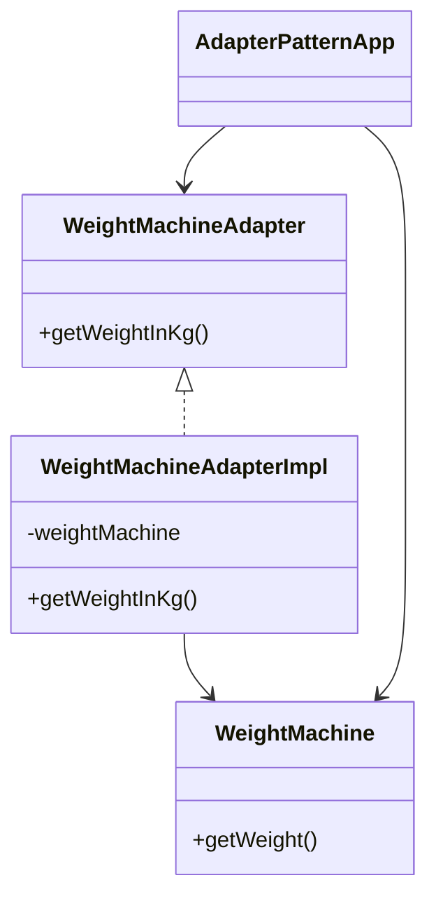
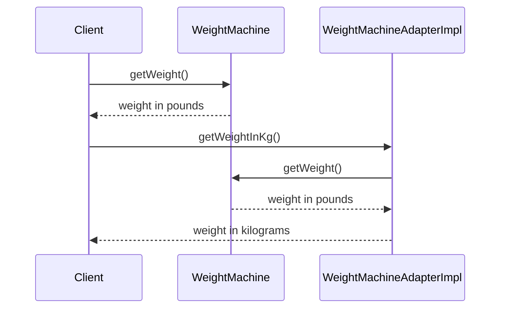

# Adapter Design Pattern

The **Adapter Design Pattern** is a structural pattern that allows objects with incompatible interfaces to work together. It acts as a bridge between two interfaces, enabling integration without modifying existing code.

This example demonstrates the Adapter pattern by converting the output of a `WeightMachine` (which provides weight in pounds) to kilograms using an adapter, making it compatible with clients expecting metric units.

## Structure

- **WeightMachine**: The adaptee, provides weight in pounds.
- **WeightMachineAdapter (Interface)**: Target interface, defines method to get weight in kilograms.
- **WeightMachineAdapterImpl**: Adapter, converts pounds to kilograms and implements the target interface.
- **AdapterPatternApp**: Client, demonstrates usage of both the adaptee and the adapter.

## How It Works

- The client (`AdapterPatternApp`) creates a `WeightMachine` object, which provides weight in pounds.
- To get the weight in kilograms, the client wraps the `WeightMachine` with a `WeightMachineAdapterImpl`.
- The adapter implements the `WeightMachineAdapter` interface and internally uses the adaptee (`WeightMachine`).
- When the client calls `getWeightInKg()`, the adapter converts the pounds value to kilograms and returns the result.
- This allows the client to work with metric units without changing the original `WeightMachine` class.

### Sequence

## Benefits

- Enables integration of incompatible interfaces.
- Promotes code reuse and flexibility.
- Avoids modifying existing code.
