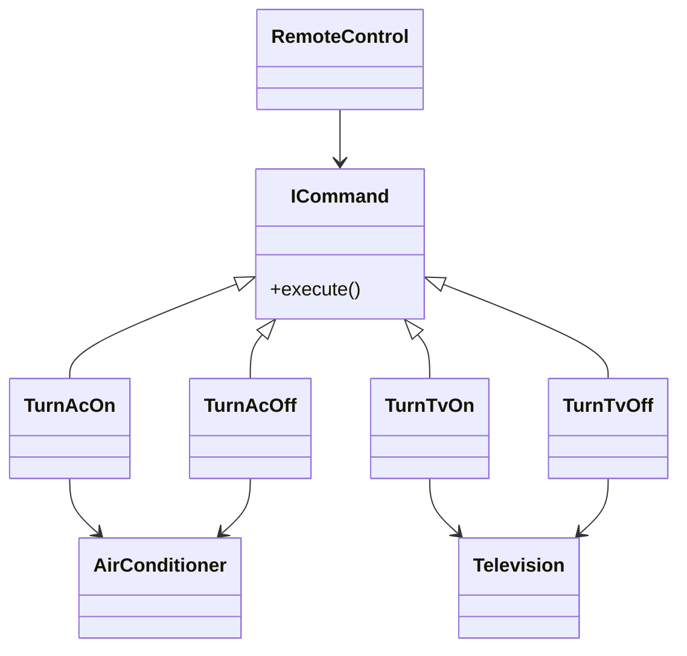
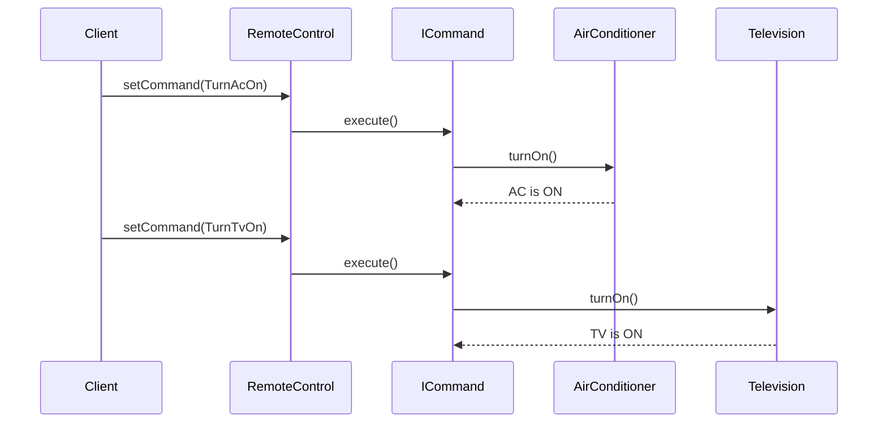

# Command Design Pattern

The **Command Design Pattern** is a behavioral pattern that encapsulates a request as an object, allowing you to parameterize clients with different requests, queue or log requests, and support undoable operations. It decouples the object that invokes the operation from the one that knows how to perform it.

## Structure

## Example: Air Conditioner (AC) & Television Control

In our Java implementation (`App.java`), we use the Command pattern to control both an AC and a Television:

- **AirConditioner**: The receiver, with methods to turn on/off.
- **Television**: Another receiver, with methods to turn on/off.
- **ICommand**: Interface with `execute()` method.
- **TurnAcOn / TurnAcOff / TurnTvOn / TurnTvOff**: Concrete commands that call `turnOn()` or `turnOff()` on the respective device.
- **RemoteControl**: The invoker, which triggers commands.

## How It Works

- The client creates command objects (`TurnAcOn`, `TurnAcOff`, `TurnTvOn`, `TurnTvOff`) that implement the `ICommand` interface.
- Each command object is associated with a specific device (AC or Television) and encapsulates the action to be performed.
- The `RemoteControl` (invoker) holds a reference to a command and triggers its `execute()` method when a button is pressed.
- The command object calls the appropriate method (`turnOn()` or `turnOff()`) on the receiver (device).
- This decouples the invoker from the actual implementation of the action, allowing for flexible command assignment, undo/redo functionality, and easy extension to new devices or actions.

### Sequence

## Benefits

- Decouples sender and receiver.
- Makes it easy to add new commands.
- Supports features like undo/redo and logging.
