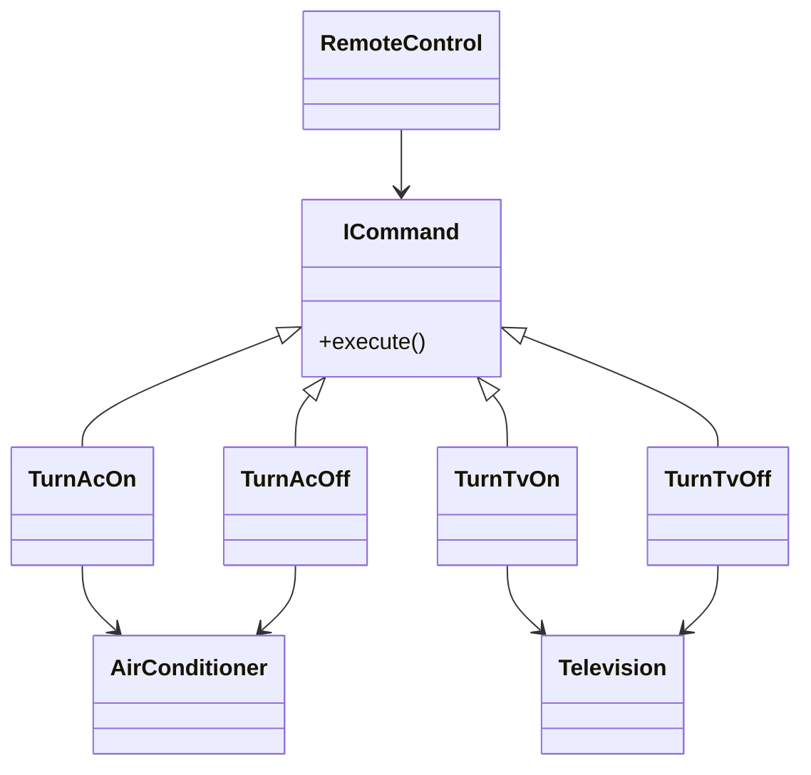
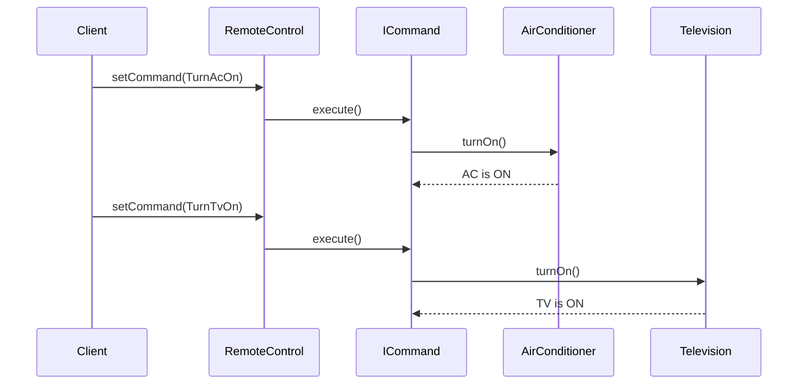

# Command Design Pattern

The **Command Design Pattern** is a behavioral pattern that encapsulates a request as an object, allowing you to parameterize clients with different requests, queue or log requests, and support undoable operations. It decouples the object that invokes the operation from the one that knows how to perform it.

## Structure

## Example: Air Conditioner (AC) & Television Control

In our Java implementation (`App.java`), we use the Command pattern to control both an AC and a Television:

- **AirConditioner**: The receiver, with methods to turn on/off.
- **Television**: Another receiver, with methods to turn on/off.
- **ICommand**: Interface with `execute()` method.
- **TurnAcOn / TurnAcOff / TurnTvOn / TurnTvOff**: Concrete commands that call `turnOn()` or `turnOff()` on the respective device.
- **RemoteControl**: The invoker, which triggers commands.

### Sequence

## Benefits

- Decouples sender and receiver.
- Makes it easy to add new commands.
- Supports features like undo/redo and logging.
