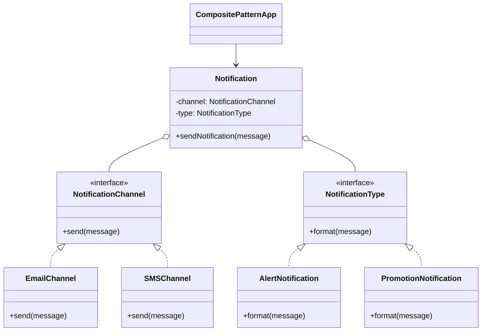
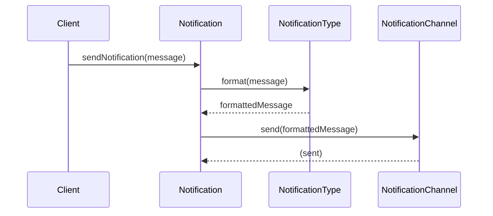

# Composite Design Pattern

The **Composite Design Pattern** is a structural pattern that lets you compose objects into tree structures to represent part-whole hierarchies. It allows clients to treat individual objects and compositions of objects uniformly. This is especially useful for building complex structures from simple components, such as UI hierarchies, file systems, or, as in this example, notification systems.

This example demonstrates the Composite pattern by simulating a notification system where different notification channels (like Email and SMS) and notification types (like Alert and Promotion) can be composed to send messages. The pattern enables flexible combinations and easy extension of notification mechanisms.

## Structure

**NotificationChannel (Interface):** Defines the contract for sending a message through a channel (e.g., Email, SMS).
**NotificationType (Interface):** Defines the contract for formatting a message (e.g., Alert, Promotion).
**EmailChannel/SMSChannel (Concrete Channels):** Implement `NotificationChannel` to send messages via specific channels.
**AlertNotification/PromotionNotification (Concrete Types):** Implement `NotificationType` to format messages for specific purposes.
**Notification (Composite):** Combines a channel and a type to send a formatted message through the chosen channel.
**CompositePatternApp (Client):** Demonstrates usage by creating and sending notifications with different combinations.

## How It Works

- The client creates instances of notification channels and types.
- A `Notification` object is created by composing a channel and a type.
- When `sendNotification` is called, the message is formatted by the type and sent through the channel.
- This allows for flexible combinations and easy extension of new channels or types.

This approach enables you to add new notification channels or types without modifying existing code, following the Open/Closed Principle.

### Sequence

## Extensibility

You can easily add new notification channels (e.g., Push, Slack) or types (e.g., Reminder, Warning) by implementing the respective interfaces. The composite structure allows for any combination without changing the core logic.

## Benefits

- **Flexibility:** Easily combine different channels and types.
- **Extensibility:** Add new channels/types with minimal changes.
- **Uniformity:** Treat individual and composite notifications the same way.
- **Maintainability:** Clean separation of concerns and adherence to SOLID principles.
