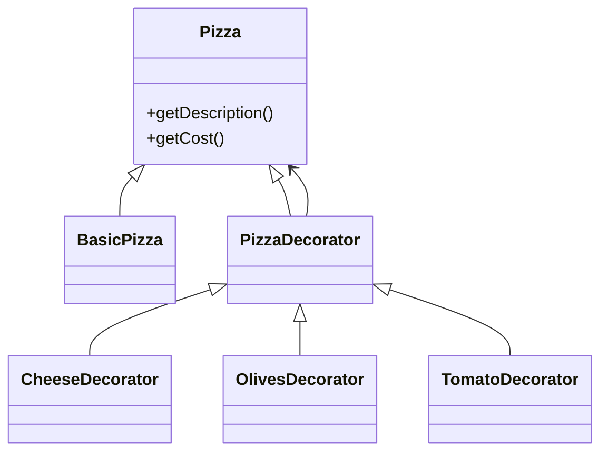
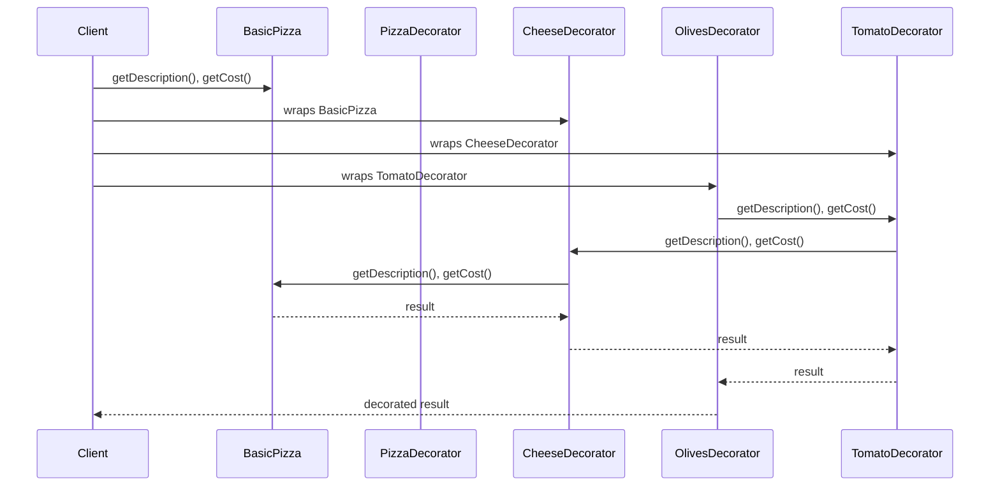

# Decorator Design Pattern

The **Decorator Design Pattern** is a structural pattern that allows you to dynamically add behavior or responsibilities to objects without modifying their code. It promotes flexible code by using composition instead of inheritance.

## Structure

## Example: Pizza Shop (Java)

In our Java implementation, we use the Decorator pattern to add toppings to a pizza:

- **Pizza**: The interface with `getDescription()` and `getCost()` methods.
- **BasicPizza**: The base pizza object, located in `pizza_shop/components/BasicPizza.java`.
- **PizzaDecorator**: Abstract class that implements `Pizza` and wraps another `Pizza` object (in `decorators/`).
- **CheeseDecorator / OlivesDecorator / TomatoDecorator**: Concrete decorators that add toppings and cost (in `decorators/`).

### Sequence

## Benefits

- Adds responsibilities (toppings) to objects dynamically.
- Promotes code reuse through composition.
- Avoids subclass explosion compared to inheritance.
