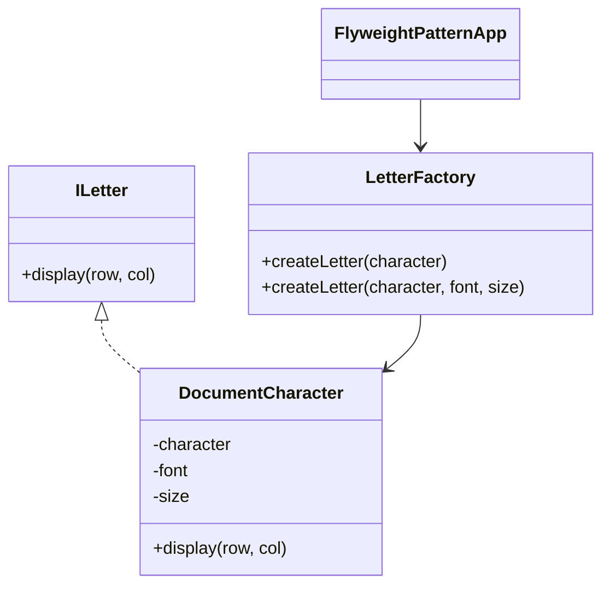

# Flyweight Design Pattern

## Overview

The Flyweight Design Pattern is a structural pattern that enables efficient memory usage by sharing as much data as possible with similar objects. It is particularly useful when dealing with large numbers of objects that have identical or similar data, such as characters in a text editor.

This example demonstrates the Flyweight pattern by simulating the design of a simple text editor, where each character displayed on the screen is represented as a flyweight object. Instead of creating a new object for every character, the pattern ensures that identical characters (with the same font and size) share the same object instance.

## Structure



**ILetter (Interface):** Defines the contract for displaying a character at a specific position.
**DocumentCharacter (Concrete Flyweight):** Implements `ILetter` and stores intrinsic state (character, font, size).
**LetterFactory (Flyweight Factory):** Manages the creation and sharing of `DocumentCharacter` instances. Ensures that identical characters are reused.
**FlyweightPatternApp (Client):** Demonstrates usage by creating and displaying characters in a simulated text editor.

## How It Works

- The client requests a character from the `LetterFactory`.
- The factory checks if an instance for the requested character (with the specified font and size) already exists.
- If it exists, the factory returns the existing instance; otherwise, it creates a new one and stores it for future reuse.
- The client then displays the character at the desired position.

This approach drastically reduces memory usage when dealing with large documents, as only one instance per unique character/font/size combination is created.

### Sequence

```mermaid
sequenceDiagram
    participant Client
    participant LetterFactory
    participant DocumentCharacter

    Client->>LetterFactory: createLetter('A')
    LetterFactory->>DocumentCharacter: new DocumentCharacter('A', ...)
    LetterFactory-->>Client: ILetter instance
    Client->>DocumentCharacter: display(0, 0)
    DocumentCharacter-->>Client: output
    ...
```

## Extensibility

The code includes an overloaded method in `LetterFactory` (commented out) to support multiple fonts and sizes, further demonstrating the flexibility of the Flyweight pattern.

## Benefits

- **Memory Efficiency:** Reduces the number of objects created, saving memory.
- **Performance:** Improves performance by reusing existing objects.
- **Scalability:** Ideal for applications like text editors, games, or GUIs where many similar objects are needed.
